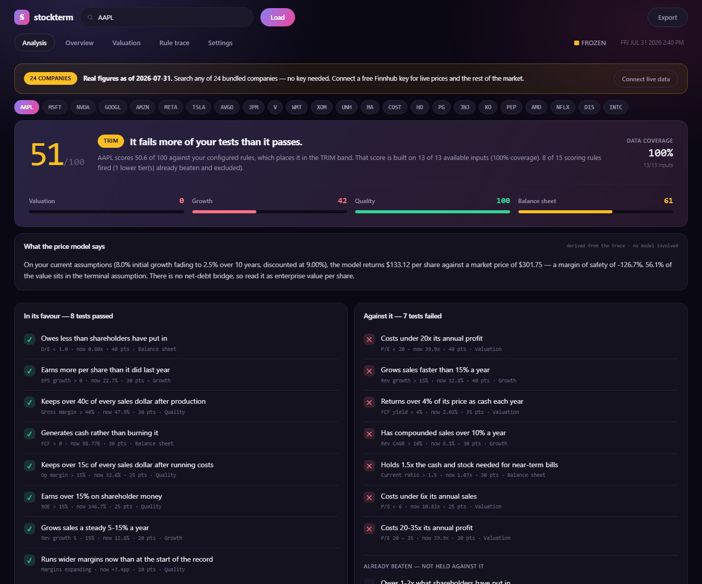
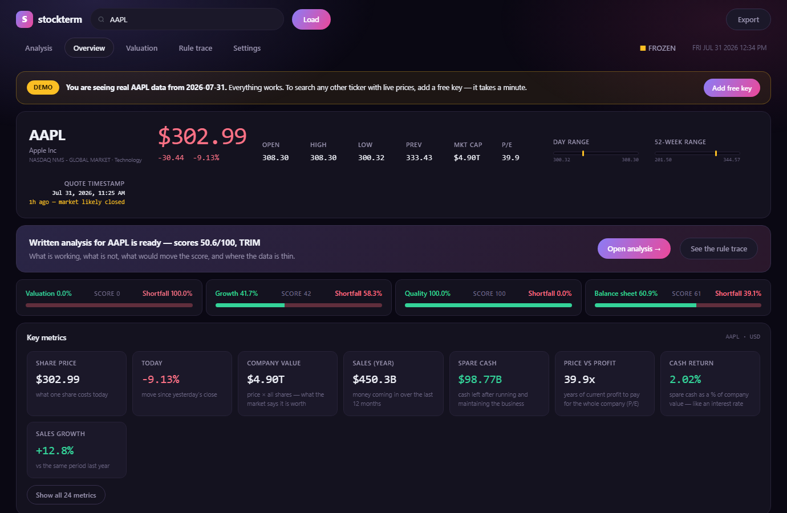

# stockterm

**A stock research terminal in a single HTML file.** No install, no server, no build step, no dependencies. Open it and it works.

It scores a company against rules you control, shows the full audit trace behind every point, runs a DCF you can push around with sliders, and writes a sourced research memo where every claim cites the filing it came from.

**[▶ Open the live demo](https://msgtoeeshan-oss.github.io/stockterm/)** — real data, nothing to sign up for.



---

## Try it

Click the link above. **24 major companies are bundled in with real data** — Apple, Microsoft, Nvidia, Alphabet, Amazon, Meta, Tesla, Broadcom, JPMorgan, Visa, Walmart, Exxon, UnitedHealth, Mastercard, Costco, Home Depot, P&G, J&J, Coca-Cola, PepsiCo, AMD, Netflix, Disney and Intel.

Every feature works on all of them with **no key, no account and no install**: the signal engine, the DCF and its sensitivity grid, the full rule trace, and the evidence pack with links to the real SEC filings.

To research the **rest of the market** with live prices:

1. Get a free key at [finnhub.io/register](https://finnhub.io/register) — a minute, no card
2. Paste it into the app
3. Done, remembered on your device

The key is stored in your browser's `localStorage`. It is **never** written into the file and never sent anywhere except Finnhub. That is what makes this repo safe to be public.

Optionally add a [Google AI Studio](https://aistudio.google.com/apikey) key in **Settings** for the AI research pass. Everything else works without it.

**Prefer offline?** Download `stock.html` and double-click it. Same app.

---

## Sharing it without making anyone paste a key

There are three ways to run this, depending on who it's for.

| | Who it suits | Users must | Costs you |
|---|---|---|---|
| **Public link** | anyone | paste their own free key for tickers outside the bundle | nothing |
| **Private build** | a handful of people you know | nothing at all | nothing |
| **Proxy** | a public audience you want to fully serve | nothing at all | your Gemini usage |

### Private build — simplest for a small group

Bakes your keys into one file you send directly. Recipients open it and everything works: every ticker, live prices, the analyst. No setup screen, no pasting.

```powershell
.\tools\build-private.ps1 -Finnhub "your_key" -Gemini "your_key"
```

It verifies both keys against the live APIs before baking them, writes `stock.local.html`, then confirms git is ignoring it and that the public `stock.html` is still key-free.

Send that file however you'd send any private document. **Anyone who receives it receives the keys** — a fair trade for a small trusted group, and the reason `*.local.html` is in `.gitignore`. Re-run it after any change to `stock.html`.

### Proxy — for a public audience

If you want the *public link* to include the analyst with no signup, a Cloudflare Worker holds your Gemini key server-side. See [`worker/README.md`](worker/README.md). Set one line in section 1:

```js
AI_PROXY: 'https://stockterm-ai.your-subdomain.workers.dev',
```

Free on Cloudflare at any realistic volume; the Gemini usage becomes yours (roughly 1–3¢ per analysis). The Worker caps requests per IP per day and refuses origins other than your site.

### What is never an option

**Putting a key in `stock.html` and pushing it.** The file is downloaded by the browser, so anything in it is readable with F12 — there is no way to hide a key in client-side code. Bots scan public repos for keys within minutes of a push. For Finnhub that means a rate-limited, broken app; for Gemini on a billed project it means uncapped charges to you. CI fails the build if a key ever appears in a tracked file.

---

## What it does

### Analysis — the landing tab

A composite score, a one-line verdict, and four factor bars you can read at a glance. Then every rule that passed or failed, written as a sentence with the technical version underneath:

> ✓ **Owes less than shareholders have put in** — `D/E < 1.0 · now 0.80x · 40 pts`
> ✕ **Costs under 20x its annual profit** — `P/E < 20 · now 39.9x · 40 pts`

Plus what would move the score most, and where the data is thin. **None of this needs an AI key.**

### Sourced research

With a Gemini key, the same tab runs a research pass with **quote-first sourcing discipline**. Three modes, each a fixed question set answered in order:

| Mode | Question |
|---|---|
| **Lynch Pitch** | Why would I own this? One idea, no stories. |
| **Munger Invert** | How could I lose money? Assumes it's a bad idea and tries to prove it. |
| **Business Brief** | What the filings say, without arguing a side. |

Every claim must cite a source and value, or be marked *Not found in sources*:

```
[FILING-FY2025, us-gaap:Revenues]: 416161000000 -> ...
[DOC-AAPL-ITEM1A, component supply]: "Because the Company currently obtains
certain components from single or limited sources..." -> ...
```

The model is told its own training knowledge does not count. Interpretations beyond a cited number get flagged as inferences.

### Bull vs Bear vs Judge

Runs the bull case and the bear case on identical evidence, then a third pass scores them **on citation quality rather than persuasiveness** — naming any claim either side made that the sources don't support, and any material fact both sides ignored.

### Drop in the 10-K

Numbers say what a company *earned*. Only the filing says what it *does* and what management admits could go wrong. Drag a 10-K onto the Analysis tab and the app extracts **Item 1 (Business)**, **Item 1A (Risk Factors)** and **Item 7 (MD&A)** as quotable sources. The app links you to the right document.

Measured on Apple's FY2025 10-K: without it the model refuses two Munger questions outright; with it, refusals drop to zero and 39 of 41 citations quote the filing directly.

HTML or plain text. **PDF is not supported** — that needs an external library, and SEC publishes the same filing as `.htm`. Files are read locally with `FileReader`; nothing is uploaded.

### Overview, Valuation, Rule trace



- **Overview** — live quote, plain-English metrics, revenue/income/cash-flow history, margin trends, watchlist heatmap
- **Valuation** — fading-growth DCF with Gordon terminal value, sliders, a 5×5 sensitivity grid, and an amber flag once terminal value passes 75% of enterprise value
- **Rule trace** — the full audit table with adjustable factor weights that recompute live

---

## Design principles

**The trace is the product.** A score with no trace is a black box. Every rule shows whether it fired, the value it tested, and the points earned — so you can disagree with a specific line rather than with a number.

**Missing data is never scored as zero.** A factor with under half its inputs available is dropped from the composite and the remaining weights renormalised. A 78 on 40% coverage is not the same claim as a 78 on 95%, and the app shows you which you're looking at.

**No confident wrong numbers.** Quotes display their exchange timestamp and staleness. In demo mode the badge reads FROZEN, not LIVE. Failed requests degrade to named warnings. Mutually exclusive tiered rules disclose their real ceiling instead of implying an unreachable 100.

**There is deliberately no backtest.** Free providers serve *restated* fundamentals — figures as they look now, not as they looked then. Scoring rules against restated history leaks the future and makes almost any rule set look brilliant. A tab producing confident wrong numbers is worse than no tab.

---

## Known limitations

- **The DCF has no net-debt bridge.** Free cash flow is discounted to an enterprise value and divided by share count. Heavy net debt looks better than it is; large net cash looks worse. Read it as enterprise value per share.
- **Quotes are not real-time.** Finnhub's `/quote` returns the last regular-session trade — no pre-market or extended hours, which is why the price can differ from TradingView. The app polls every 15s and always shows the timestamp.
- **Statement line items are matched on concept-name substrings**, which vary by filer. Spot-check the as-reported table against the real filing before leaning on a number.
- **Historical EPS is as-reported**, so figures spanning a stock split are not comparable year to year.
- **MD&A depth varies.** Some filers incorporate Item 7 by reference rather than printing it; the parser captures what's there rather than pretending.
- **The AI modes are prompts, not training.** They change which questions get asked of the same numbers. They add no ability to predict prices.

---

## Data sources

| Source | Used for | Key |
|---|---|---|
| [Finnhub](https://finnhub.io) | quotes, profile, metrics, as-reported financials, SEC filing index | free, yours |
| [Google Gemini](https://aistudio.google.com/apikey) | the research pass only | free, optional |
| SEC EDGAR | filing documents you drop in | none |

**Why not Yahoo Finance / `yfinance`?** Yahoo's endpoints return data but send **no CORS headers at all**, so a browser blocks the response regardless of where the page is hosted — verified against a real HTTPS origin and on the preflight. The richer endpoints (`quoteSummary`, options) return `401` without a server-side cookie/crumb handshake, which is exactly what the Python `yfinance` package performs for you. Supporting Yahoo requires a backend, which would mean hosting costs and your key funding every visitor's usage. Finnhub is used because it sends `Access-Control-Allow-Origin: *`.

---

## Host your own copy

The whole app is one static file, so GitHub Pages serves it free with no build step.

1. Push this repo to GitHub as **Public**
2. **Settings → Pages → Source: Deploy from a branch**
3. Branch **`main`**, folder **`/ (root)`** → **Save**
4. Wait a minute — your link is `https://msgtoeeshan-oss.github.io/stockterm/`

`index.html` is a copy of `stock.html`; that's what makes the bare URL resolve. After editing the app:

```bash
cp stock.html index.html
git commit -am "update" && git push
```

---

## Configuration

The script is split into 12 numbered sections with a map in the header comment, so changes can be scoped precisely ("edit section 6").

| § | Contents |
|---|---|
| 1 | Config — factor rules, weights, bands, tabs, watchlist, research modes, demo snapshot |
| 2 | Utilities — parsing, formatting, HTML escaping, filing text extraction |
| 3 | State — single store, persistence |
| 4 | API — Finnhub + Gemini calls, evidence pack, error mapping |
| 5 | Metrics — derived figures |
| 6 | Signal engine — scoring + audit trace |
| 7 | DCF — model and sensitivity grid |
| 8 | Charts — hand-rolled SVG |
| 9 | Components — HTML builders |
| 10 | Views — one per tab |
| 11 | Render + events |
| 12 | Actions |

Scoring rules live in `CFG.FACTORS` in section 1. Each carries its threshold, point value, the metric keys it needs, and a plain-English description. Change them there and the trace, the assessment and the export all follow automatically.

---

## Security

**No API key is committed to this repository, and none should ever be.** See [SECURITY.md](SECURITY.md).

A GitHub Action scans every push and fails the build if a key pattern appears in the source.

---

## Disclaimer

**A modelling tool, not investment advice. Nobody involved in it is a licensed financial advisor.**

The bands (Accumulate / Hold / Trim / Avoid) are labels attached to score ranges *you* configure — your own rule set scoring itself, not a recommendation. Figures come from third-party APIs and may be wrong, stale or misattributed. Verify before acting on anything.

## Licence

MIT — see [LICENSE](LICENSE).
